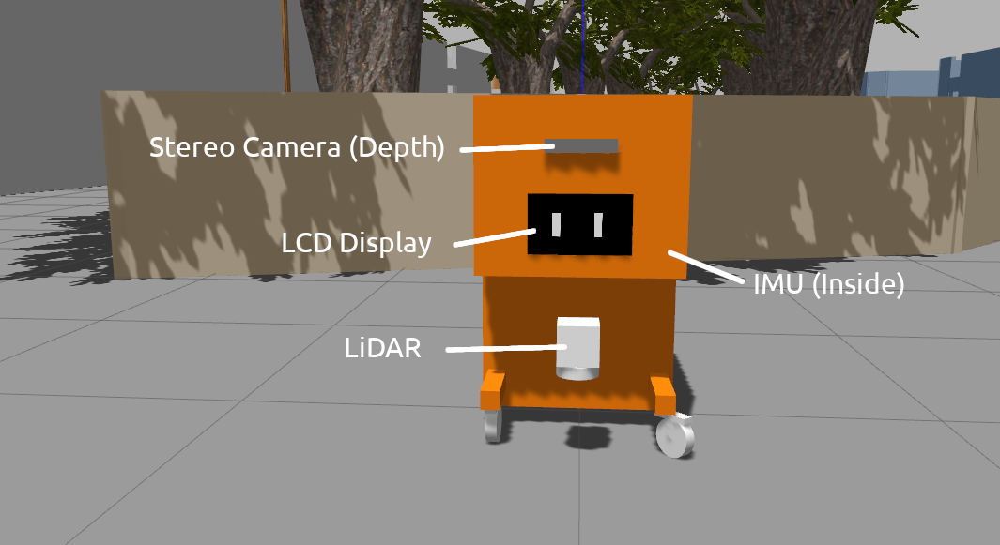
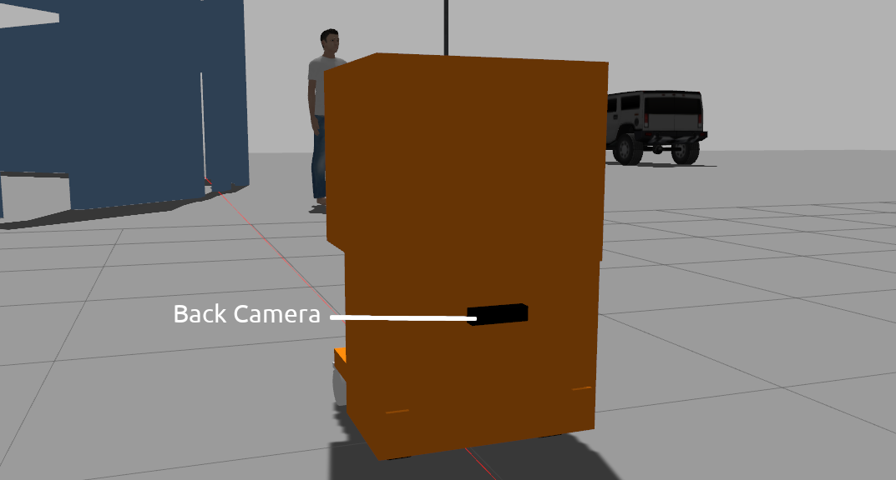
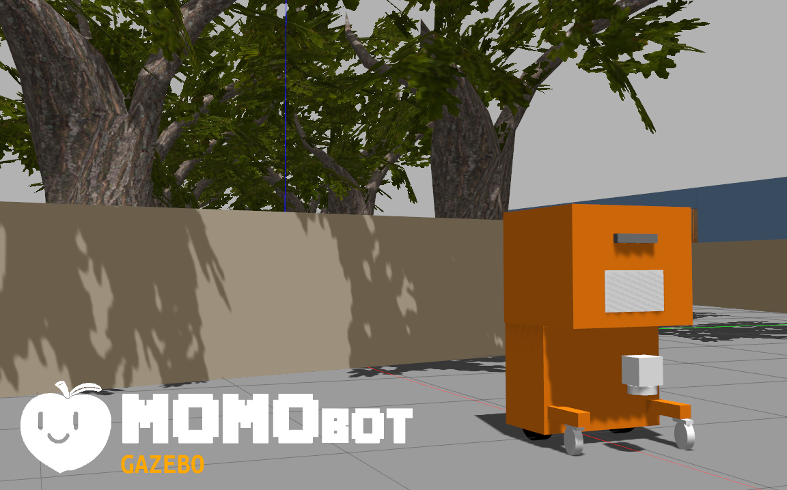

# MOMOBot Gazebo


## Pre-requisite
This model is tested on Gazebo 9, so it is assumed that Gazebo simulator is already installed. Also ensure that ROS Navigation Stack & [teb_local_planner package](https://github.com/rst-tu-dortmund/teb_local_planner) has been installed.

## Installation
### ROS
Git clone the repository & place the directories in your workspace (E.g. catkin_ws).
```
$ git clone --recurse-submodules -j8 https://github.com/1487quantum/momobot_gazebo.git
```
> Note: *--recurse-submodules* clones the submodules included in this repository, *-j8* fetches up to 8 submodules at a time (in parallel).

Compile the workspace via *catkin_make* and the packages are ready to use!
```
$ catkin_make
```
> **Note**: Please install the required dependencies before compilation.
### Gazebo
Copy all the models from the *mo2bot_gazebo/models* directory into the *.gazebo/models* directory. (Should be located in the */home/{user}/* directory.)
```
cp -r mo2bot_gazebo/models/* ~/.gazebo/models
```

## Sensor


The IMU is placed inside the body of the model.




## Usage
### Launching Gazebo World

Launches Gazebo simulator with the robot model in the Compound World:
```
$ roslaunch mo2bot_gazebo mo2bot_world.launch
```

### Navigation
Navigation with teb_local_planner plugin:
```
$ roslaunch mo2bot_control nav.launch
```

### Subscribed Topics
> #### /cmd_vel (geometry_msgs/Twist)
- To move the robot via velocity commands.

> #### /lcd_img (sensor_msgs/Image)
- Displays the image on the LCD screen.

## Rosgraph


